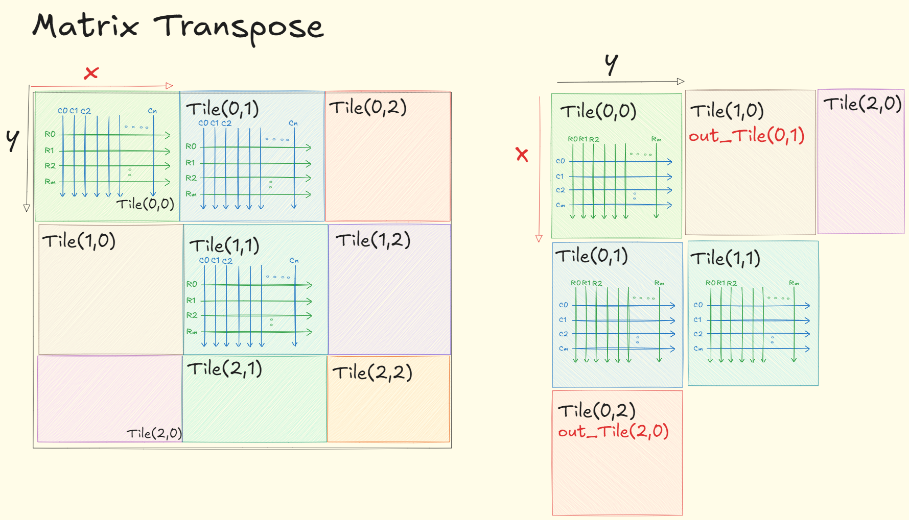

# Matrix Transpose



* `OUT_TILE(x, y) = IN_TILE(y, x)`
    * `IN_TILE_X = blockDim.x, IN_TILE_Y = blockDim.y` 
    * `OUT_TILE_X = blockDim.y, OUT_TILE_Y = blockDim.x `
* to read coleased -> read input rows
* to write coleased -> write output rows = write input columns
* let **`TILE_DIM = 32`** to allow coleasing

```cpp
__global__ void matrix_transpose_kernel(int *matrix, int *matrix_out) {
    __shared__ int sh_mem[TILE_DIM][TILE_DIM];
    int global_x = threadIdx.x + blockIdx.x * TILE_DIM;
    int global_y = threadIdx.y + blockIdx.y * TILE_DIM;
    // 1. read coleased
    if(global_x < NCOLS && global_y < NROWS) {
        sh_mem[threadIdx.y][threadIdx.x] = matrix[GET_IDX(global_y, global_x, NCOLS)];
    }
    
    __syncthreads();

    // 2. write coleased
    int out_global_x = threadIdx.x + blockIdx.y * TILE_DIM;
    int out_global_y = threadIdx.y + blockIdx.x * TILE_DIM;

    if (out_global_x < NROWS && out_global_y < NCOLS) {
        matrix_out[GET_IDX(out_global_y, out_global_x, NROWS)] = sh_mem[threadIdx.x][threadIdx.y];
    }
}
```
```cpp
dim3 threadsPerBlock(TILE_DIM, TILE_DIM);
```

